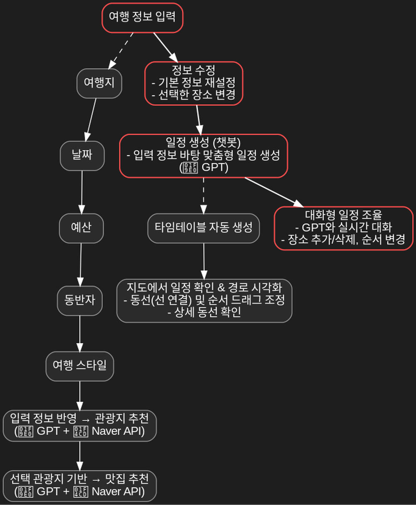

# 🌍 JustGo — AI 기반 맞춤 여행 일정 추천 플랫폼
[](https://github.com/사용자명/저장소명/stargazers)
[](https://github.com/사용자명/저장소명/network/members)
[](https://github.com/사용자명/저장소명/issues)
[](https://github.com/사용자명/저장소명/commits/main)
[](/LICENSE)


> **여행 계획을 더 쉽고, 똑똑하게**
>
> 사용자가 입력한 여행지, 날짜, 예산, 동반자, 스타일을 기반으로 **GPT**가 맞춤형 여행 일정을 추천하고, **네이버 API**를 통해 실제 장소 리뷰와 지도 링크를 제공합니다. 또한, **챗봇과 대화하며 일정을 자유롭게 수정**할 수 있습니다.

---

## ✨ 데모

* 🎬 **시연 영상**: [YouTube 링크](https://youtu.be/your-demo-link)

---

## 🧭 목차

* [배경 & 목표](#-배경--목표)
* [주요 기능](#-주요-기능)
* [시스템 아키텍처](#-시스템-아키텍처)
* [주요 화면](#-주요-화면)
* [기술 스택](#-기술-스택)
* [빠른 시작](#-빠른-시작)
* [환경 변수](#-환경-변수)
* [API 개요](#-api-개요)
* [데이터 모델](#-데이터-모델)
* [보안 설계](#-보안-설계)
* [로드맵](#-로드맵)
* [팀](#-팀)
* [라이선스](#-라이선스)

---

## 🎯 배경 & 목표

* 기존 여행 앱은 **사용자 취향 반영 부족** → JustGo는 **개인화된 여행 일정**을 실시간 추천
* GPT를 활용해 사용자가 원하는 스타일과 조건을 반영한 여행 일정 제공
* 챗봇과의 대화를 통해 **일정 수정 및 세부 조정 가능**
* 네이버 장소 리뷰/지도 링크로 **신뢰성 있는 여행 정보** 제공

---

## 💡 주요 기능

* **여행 정보 입력**: 여행지, 날짜, 예산, 동반자, 스타일 선택
* **GPT 일정 추천**: ±15% 예산 범위 준수, 사용자 조건 기반 일정 생성
* **네이버 API 연동**: 관광지/맛집 리뷰·지도 링크 제공
* **챗봇 일정 조율**: GPT와 대화를 통해 일정 수정·재추천
* **UI/UX**: 카드형 일정, 클릭 시 상세 일정 토글

---

## 🏗 시스템 아키텍처

```
[Frontend] HTML/CSS/JS → FastAPI(Backend) → OpenAI GPT & Naver API
```

* **Frontend**: HTML, CSS, JavaScript (카드형 UI, localStorage 데이터 전달)
* **Backend**: FastAPI (GPT·네이버 API 연동, 데이터 가공)
* **External APIs**: OpenAI, 네이버 장소·리뷰 API

---

## 📱 주요 화면

* **여행 설정 페이지**: 여행지, 날짜, 예산, 스타일, 동반자 입력
* **일정 추천 페이지**: GPT 생성 일정 표시, 클릭 시 상세 일정 토글
* **지도 페이지**: 선택한 일정 경로·장소 지도 표시
* **챗봇 페이지**: GPT와 일정 수정 및 재추천 대화

---

## 🧰 기술 스택

* **Frontend**: HTML, CSS, JavaScript
* **Backend**: Python(FastAPI)
* **AI**: OpenAI GPT (chat.completions)
* **API**: 네이버 장소 검색/리뷰 API

---

## 🚀 빠른 시작

```bash
# Backend
cd backend
pip install -r requirements.txt
uvicorn main:app --reload

# Frontend
# 브라우저로 frontend/index.html 실행
```

---

## 🔧 환경 변수

`.env`

```ini
OPENAI_API_KEY=
NAVER_CLIENT_ID=
NAVER_CLIENT_SECRET=
```

---

## 📡 API 개요

* `POST /api/plan` → GPT 일정 생성
* `POST /api/recommend/places` → 네이버 API로 장소 리뷰·지도 링크 제공

---

## 🗃 데이터 모델

* **입력 데이터**: 여행지, 날짜, 예산, 동반자, 스타일
* **출력 데이터**: 일정명, 날짜별 세부 일정, 총 예상 비용, 장소 정보(지도 링크, 리뷰)

---

## 🔐 보안 설계

* API 키 환경 변수 관리(.env)
* 서버 측에서 OpenAI/네이버 API 호출 후 데이터만 반환

---

## 🗺 로드맵

* [ ] 챗봇 기반 실시간 일정 수정 기능 고도화
* [ ] 지도 경로 표시 최적화
* [ ] 다국어 지원
* [ ] 여행지 사진 자동 포함

---

## 👥 팀

| 역할       | 이름 | 담당                    |
| -------- | -- | --------------------- |
| Backend  | A  | GPT 연동, 일정 생성 API     |
| Backend  | B  | 네이버 API 연동, 데이터 가공    |
| Frontend | C  | UI/UX 설계, HTML/CSS 구현 |
| Frontend | D  | JS 로직, 데이터 연동         |

---

## 📄 라이선스

MIT License


## 🗺 서비스 흐름


---

